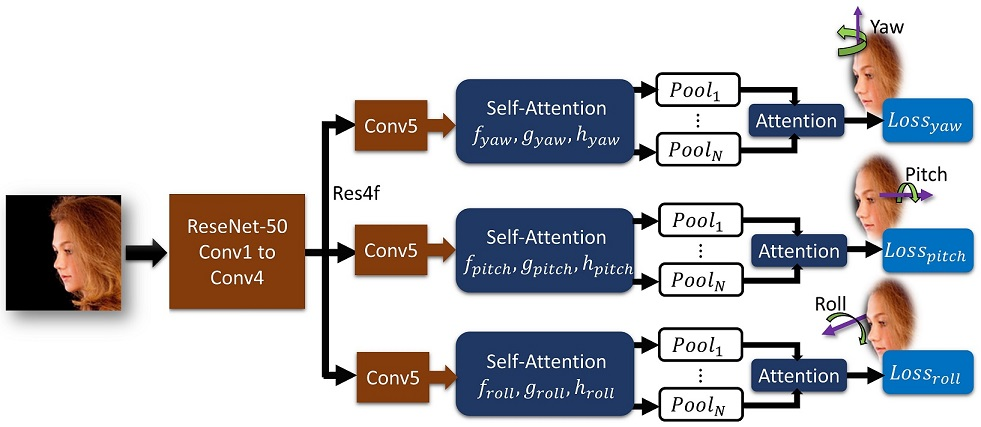
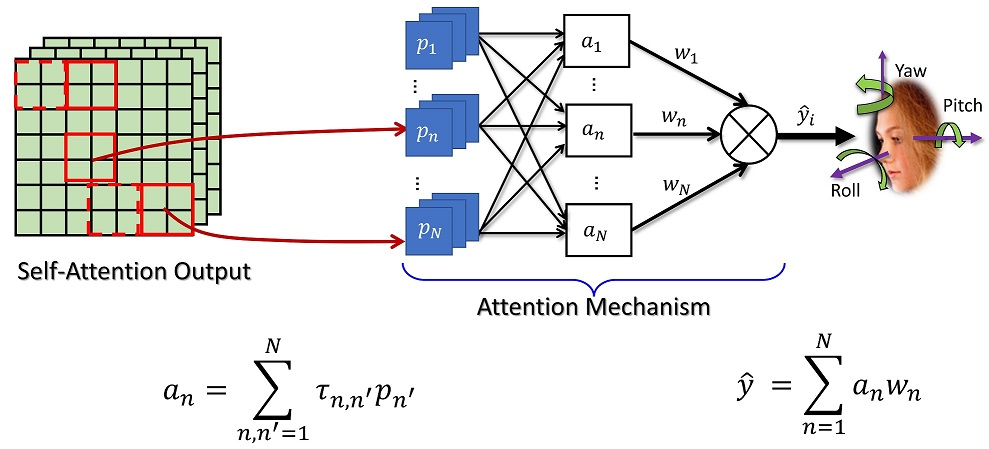

##  Rotation Axis Focused Attention Network (RAFA-Net) for Estimating Head Pose
**Ardhendu Behera, Zachary Wharton, Pradeep Hewage and Swagat Kumar**<br>
**_Department of Computer Science, Edge Hill University, United Kingdom_**

### Abstract
Head pose is a vital indicator of human attention and behavior. Therefore, automatic estimation of head pose from images is key to many real-world applications. In this paper, we propose a novel approach for head pose estimation from a single RGB image. Many existing approaches often predict head poses by localizing facial landmarks and then solve 2D to 3D correspondence problem with a mean head model. Such approaches completely rely on the landmark detection accuracy, an ad-hoc alignment step, and the extraneous head model. To address this drawback, we present an end-to-end deep network, which explores rotation axis (yaw, pitch, and roll) focused innovative attention mechanism to capture the subtle changes in images. The mechanism uses attentional spatial pooling from a self-attention layer and learns the importance over fine-grained to coarse spatial structures and combine them to capture rich semantic information concerning a given rotation axis. The experimental evaluation of our approach using three benchmark datasets is very competitive to state-of-the-art methods, including with and without landmark-based approaches.


**RAFA-Net for estimating head poses by introducing rotation axis-specific (yaw, pitch and roll) self-attention and attentional pooling components.**


**Rotation Axis Focused Novel Attentional Pooling.**

### Paper and Supplementary Information
Open Access of the accepted paper in [The CVF](https://openaccess.thecvf.com/content/ACCV2020/html/Behera_Rotation_Axis_Focused_Attention_Network_RAFA-Net_for_Estimating_Head_Pose_ACCV_2020_paper.html).

[Supplementary Document](0458-supp.pdf)

[Source code](https://github.com/ArdhenduBehera/RAFA-Net)

### Bibtex
```markdown
@inproceedings{behera2020rotation,
  title={Rotation Axis Focused Attention Network (RAFA-Net) for Estimating Head Pose},
  author={Behera, Ardhendu and Wharton, Zachary and Hewage, Pradeep and Kumar, Swagat},
  booktitle={Proceedings of the Asian Conference on Computer Vision (ACCV)},
  year={2020}
}
```

### Acknowledgements

This research was supported by the UKIERI (CHARM) under grant DST UKIERI-2018-19-10. The GPU is kindly donated by the NVIDIA Corporation.
